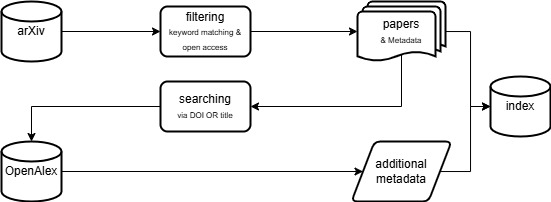

<figure>
  
</figure>

---

Status: 

Tested on: [](https://img.shields.io/badge/Google%20Chrome-4285F4?style=flat-square&logo=GoogleChrome&logoColor=white)
[](https://img.shields.io/badge/Windows%2011-%230079d5.svg?style=flat-square&logo=Windows%2011&logoColor=white)

Frontend/Design: [](https://img.shields.io/badge/Canva-%2300C4CC.svg?style=flat-square&logo=Canva&logoColor=white)
[](https://img.shields.io/badge/bootstrap-%238511FA.svg?style=flat-square&logo=bootstrap&logoColor=white)
[](https://img.shields.io/badge/css3-%231572B6.svg?style=flat-square&logo=css3&logoColor=white)
[](https://img.shields.io/badge/html5-%23E34F26.svg?style=flat-square&logo=html5&logoColor=white)

Backend: [](https://img.shields.io/badge/python-3670A0?style=flat-square&logo=python&logoColor=ffdd54)
[](https://img.shields.io/badge/flask-%23000.svg?style=flat-square&logo=flask&logoColor=white)
[](https://img.shields.io/badge/jinja-white.svg?style=flat-square&logo=jinja&logoColor=black)
[](https://img.shields.io/badge/javascript-%23323330.svg?style=flat-square&logo=javascript&logoColor=%23F7DF1E)
[](https://img.shields.io/badge/docker-%230db7ed.svg?style=flat-square&logo=docker&logoColor=white)
[](https://img.shields.io/badge/git-%23F05033.svg?style=flat-square&logo=git&logoColor=white)

Docs: [](https://img.shields.io/badge/markdown-%23000000.svg?style=flat-square&logo=markdown&logoColor=white)

Serverhosting: 
[](https://img.shields.io/badge/nginx-%23009639.svg?style=flat-square&logo=nginx&logoColor=white)
[](https://img.shields.io/badge/Ubuntu-E95420?style=flat-square&logo=ubuntu&logoColor=white)

Contact: [](https://img.shields.io/badge/linkedin-%230077B5.svg?style=flat-square&logo=linkedin&logoColor=white)
[](https://img.shields.io/badge/github-%23121011.svg?style=flat-square&logo=github&logoColor=white)

---

## Project Overview

**ORBIT** (Optimized Retrieval for Beyond Interstellar Technologies) is a search and retrieval system built on **Apache Solr**, designed to support advanced indexing and querying functionality for space/AI scenarios.

ORBIT specializes in indexing and retrieving **scientific papers** in the field of **intelligent systems for space exploration and Earth observation**.  
It is tailored to support research workflows and discovery in these high-impact, data-intensive domains.

---

## Current Status

- Development is active  
- Data acquisition has been implemented as a pipeline  
- Solr index schema has been designed and created  
- Indexing pipeline is in place  
- Search features include: **keyword search**, **wildcard search**, **phrase search**, and **faceted search**  
- Faceted navigation is already visualized  
- Basic spellchecking is enabled  
- Spell recommendations are visualized

**TODO:**
- Identifying similar documents (More Like This feature)
- Autocompletion
- Highlighting query terms in the search result preview
- Frontend development
---

## Installation & Setup

### Create Venv
On Linux/macOS:
```bash
python3 -m venv venv
source venv/bin/activate
```

On Windows:
```bash
python -m venv venv
venv\Scripts\activate
```

### Install required packages
```bash
pip install -r requirements.txt
```

### Solr Core Initialization
```bash
docker exec -it solr-server solr create_core -c orbit
```

### Solr Core Configuration
```bash
docker exec -it solr-server solr config -c orbit --action set-user-property --property update.autoCreateFields --value false
```

### Important Schema-Steup
Has to be added to the ``solrconfig.xml`` of your core to activate spellchecking.

Add to ``searchComponent`` in ``solrconfig.xml``:
```xml
<str name="field">spellcheck_base</str>
```
Add to ``requestHandler`` in ``solrconfig.xml``:
```xml
<str name="spellcheck">true</str>
```

### Data acquisition
During data acquisition, scientific papers are collected from **arXiv.org** using their public API and enriched with additional metadata from **OpenAlex.org**, also via API access.
The process can be started by running the script ``index_main.py`` with the command ``python index_main.py``. It will automatically create the necessary folders and files for indexing.
Please make sure to adjust the file paths in the ``config.yml`` according to your local setup and preferences.

**Important**: The amount of data depends on the parameters set in ``./orbit_utils/data_access.py``: ``main_access()`` (See comment).

<figure>
  
</figure>

### Indexing
Indexing is also handled via ``index_main.py``.
The collected data is indexed based on the Solr schema defined in ``orbit_utils/create_solr_schema.py``.

**Important**: Don’t forget to set the correct Solr core name in ``config.yml`` to ensure the data is indexed into the intended core.

### Start the Web App
The web application can be started using the ``app.py`` file located in the ``ORBIT_SE`` folder.
First, make sure you in the main directory of the project, then start the app with the command ``python -m ORBIT_SE.app``.
Then navigate to ``http://127.0.0.1:5000`` in your borwser and start searching!

## How to search in ORBIT?
After starting the web app and navigating to your localhost in your browser:

- **Keyword search**: Type any search terms of your choice
- **Wildcard search**: You can use the wildcard symbol ``*`` for search as follows:
  - examnple*
  - *example
  - exam*le

You can combine the wildcards.

- **Phrase search**: You can use the ""-marks to search for the specific word like "AI" or "Explainable AI"
- **Faceted search**: After searching a term you can select from the following facets to filter the results:
  - concepts
  - open access
  - language
  - journal
  - type

You can combine multiple facets.

## Contact & Collaboration
For questions, feedback, or contributions to the project, please reach out to me, the developer.

---

Thank you for your interest in **ORBIT**!
